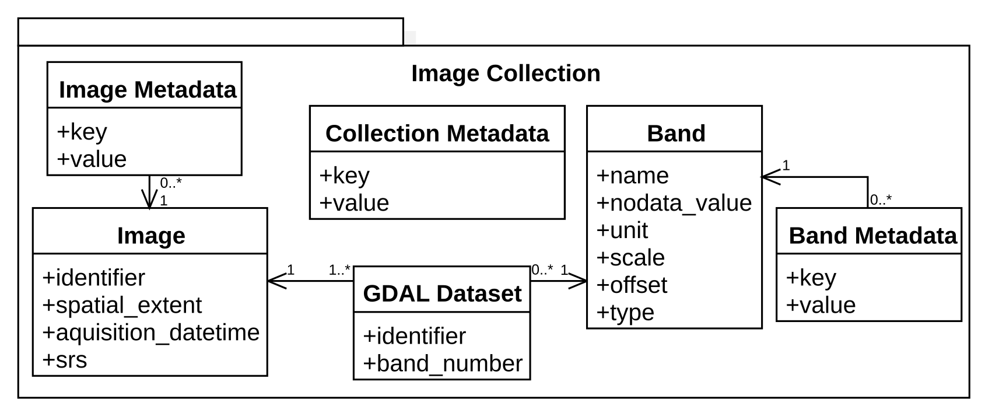

Image Collections
==================================================

In gdalcubes, an *image collection* is a set of :math:`n` images, with data for :math:`m` variables (or *bands*). Variables of the same image share a spatial footprint, recording date/time, and spatial reference system but may vary in spatial resolution. Different images may have different spatial footprints, recording date/times, and spatial reference systems.

GDAL Datasets
--------------------------------------------------

Actual band data may come from any **GDAL dataset** (see https://gdal.org/user/raster_data_model.html), i.e., from anything that is readable by GDAL. This includes simple files, cloud storage, databases, and archive files through [GDAL virtual file systems](https://www.gdal.org/gdal_virtual_file_systems.html). 
Examples for readable datasets include:

- ``test.tif`` (a simple local GeoTIFF file), 
- ``/vsizip/archive.zip/xyz.tif`` (a GeoTIFF file in a .zip archive), 
- ``HDF4_EOS:EOS_GRID:"MOD13A2.A2013353.h00v08.006.2018226105756.hdf":MODIS_Grid_16DAY_1km_VI:1 km 16 days NDVI`` (a subdataset in a HDF4 file from MODIS)
- ``SENTINEL2_L1C:S2A_OPER_MTD_SAFL1C_PDMC_20150818T101440_R022_V20150813T102406_20150813T102406.xml:10m:EPSG_32632`` (a higher level GDAL Sentinel 2 dataset), or
- ``/vsicurl/https://download.osgeo.org/geotiff/samples/spot/chicago/UTM2GTIF.TIF`` (file on an HTTP server). 
- ``/vsis3/sentinel-s2-l1c/tiles/31/U/FT/2018/5/6/0/B08.jp2`` (Sentinel 2 on Amazon Web Services)

Image Collection Data Model
--------------------------------------------------

gdalcubes implements the above definition of image collections in the following data model.

   Data model for image collections.

This model describes available images, available bands, and how specific GDAL datasets relate to images and bands of a collection. The data model simply points to actual data by GDAL dataset identifiers but does not store any image data. It is implemented as a relational SQLite (https://www.sqlite.org/index.html) database, i.e. can be stored as a single file, which typically consumes a few kilobytes per image. To allow for fast selection of images intersecting a given spatiotemporal area, the schema include indexes on the spatial extent and recording date/time.

gdalcubes comes with functions to create image collections from a set of GDAL dataset identifiers. Unfortunately, it is not straightforward to extract all
needed information (e.g. recording date/time) automatically from GDAL datasets. Earth observation data products are organized in extremely different ways, from single files per image to complex directory structures like the Sentinel 2 SAFE format. To let gdalcubes know, how to create image collections from a set of GDAL dataset identifiers, we must define so called **image collection formats** for particular data products. Formats for some Sentinel, Landsat, and MODIS products are contained in gdalcubes. The collection format definition is described in detail in the next chapter.

