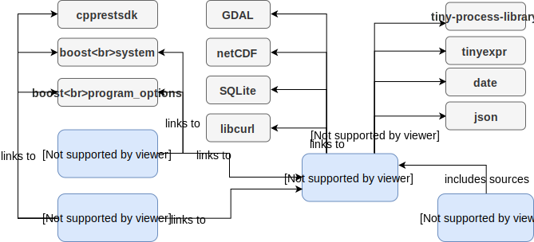

Overview
===============

The core part of gdalcubes is implemented as a C++ library, linking to `GDAL <https://www.gdal.org>`_, `NetCDF <https://www.unidata.ucar.edu/software/netcdf>`_, `SQLite <https://www.sqlite.org>`_, and `libcurl <https://curl.haxx.se/libcurl>`_.
Among others, the library provides data structures for *image collections*, *raster data cubes*, and implements
the creation of data cubes and some functions on data cubes (see Basic Concepts). 

An executable command line interface links to the gdalcubes library and provides functionality to create and modify
image collections, and to execute chains of data cube operations. It is mainly used for debugging and profiling.

gdalcubes includes a server application, exposing parts of the library functions as a REST-like web service.
The web service is mainly used for distributed processing where server instances participate as worker nodes. 

The R package targets at data scientists and provides an easy to use iterface to the gdalcubes library.
It is, however, mostly a wrapper, i.e. does not add much functionality. The package includes the sources of the core
library, i.e. it does not link to the separate library. 

The figure below summarizes components of gdalcubes, how they are related, and their external dependencies.

.. note::

    Some external libraries are included in the sources, i.e., they will be compiled together with gdalcubes, and do
    not need to be built separately.

   Components and dependencies of gdalcubes.

  
